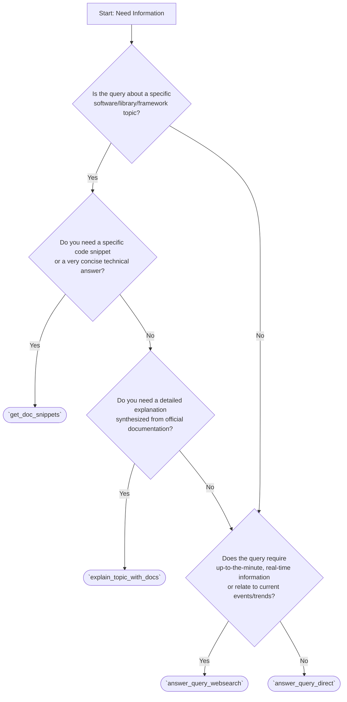

# Global Rules: Vertex AI MCP Server Usage

This file contains global rules and guidelines for utilizing the `vertex-ai-mcp-server` tools, particularly focusing on selecting the appropriate tool for information retrieval tasks.

## 1. Guiding Principles for Tool Selection

When seeking information using the `vertex-ai-mcp-server`, the primary goal is to obtain the most accurate, relevant, and concise information efficiently. Consider the nature of the query, the desired level of detail, and the importance of up-to-date information or official documentation.

## 2. Tool Selection for Information Retrieval

The following guidelines help in choosing between `answer_query_websearch`, `answer_query_direct`, `explain_topic_with_docs`, and `get_doc_snippets`.

### 2.1. `answer_query_direct`
*   **Use When:**
    *   The query is general knowledge and does not require real-time, up-to-the-minute information.
    *   You need a quick answer based on the model's existing training data.
    *   The query is not about a rapidly evolving software topic or specific version details where official documentation is paramount.
*   **Example Query Types:** "Explain the concept of REST APIs," "What are common uses for Python decorators?"

### 2.2. `answer_query_websearch`
*   **Use When:**
    *   The query requires current, up-to-date information that might have changed since the model's last training cut-off.
    *   You need a general answer that benefits from recent web search results.
    *   The query is about current events, latest software releases (not deep-dive docs), or trending topics.
*   **Example Query Types:** "What are the latest features in React 19?", "Current best practices for cloud security in 2025."

### 2.3. `get_doc_snippets`
*   **Use When:**
    *   You need a specific, authoritative code snippet for a technical task (e.g., how to make an HTTP request in Python using the `requests` library).
    *   You are looking for a concise answer to a technical question that is typically found in official documentation (e.g., "What is the default timeout for `axios`?").
    *   The `topic` (software/library/framework) is well-defined, and you might have a specific `version` in mind.
    *   Precision and adherence to official documentation are critical.
*   **Input Focus:** Requires a clear `topic` and `query`. `version` is optional but helpful.
*   **Example Query Types:**
    *   Topic: "Python requests", Query: "How to send a POST request with JSON data?"
    *   Topic: "PostgreSQL 16", Query: "Syntax for creating an index."

### 2.4. `explain_topic_with_docs`
*   **Use When:**
    *   You need a detailed explanation of a specific software topic, concept, or feature.
    *   The explanation should be synthesized primarily from official documentation found via web search.
    *   You require a comprehensive understanding with context, not just a quick snippet or answer.
    *   The `topic` (software/library/framework) is well-defined.
*   **Input Focus:** Requires a clear `topic` and `query`.
*   **Example Query Types:**
    *   Topic: "React Router", Query: "Explain the differences between `BrowserRouter` and `HashRouter` and their use cases."
    *   Topic: "Docker Networking", Query: "Provide a detailed explanation of bridge networks in Docker."

## 3. Decision Flowchart

The following diagram illustrates a decision process for selecting the appropriate tool:

## 4. General Considerations
*   **Specificity:** Provide clear and specific `query` and `topic` (where applicable) parameters for better results.
*   **Iteration:** If the first tool chosen doesn't yield the desired result, re-evaluate the query and consider trying a different, more appropriate tool based on these guidelines.